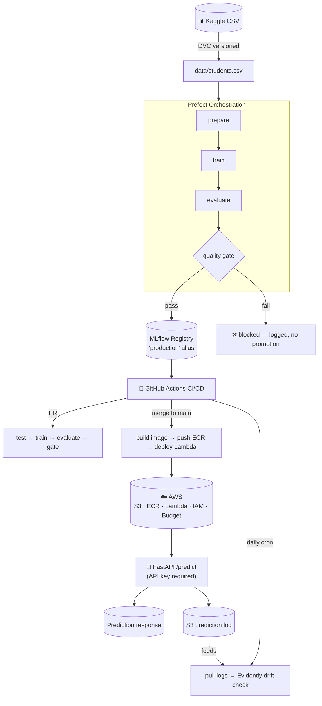

<div align="center">

# 🎓 Student Score Predictor — End-to-End MLOps Pipeline

**A small model, taken all the way to production — the right way.**

*Data versioning → Experiment tracking → Orchestration → CI/CD → Containerization → Cloud infra → Monitoring → Security → Deployment strategy*

[](https://www.python.org/)
[](https://fastapi.tiangolo.com/)
[](https://mlflow.org/)
[](https://dvc.org/)
[](https://www.prefect.io/)
[](https://www.docker.com/)
[](https://opentofu.org/)
[](https://aws.amazon.com/)
[](https://github.com/features/actions)
[](#-license)

</div>

---

## 📌 About

This repo isn't "a notebook that trains a model." It's a small regression model — predicting a student's exam score from study habits and support context — carried through **every stage a real ML system needs before it can be trusted in production**: versioned data, tracked experiments, an orchestrated pipeline, a CI/CD gate that blocks bad models from shipping, a containerized service, real cloud infrastructure, live drift monitoring, and basic security hardening.

The model itself is deliberately simple. The point of this repo is everything *around* the model.

> 💡 **Why this exists:** built as a hands-on MLOps learning project — small enough to train in minutes, complete enough to demonstrate the full lifecycle an ML Engineer is expected to own.

---

## 📋 Table of Contents

- [🎓 Student Score Predictor — End-to-End MLOps Pipeline](#-student-score-predictor--end-to-end-mlops-pipeline)
  - [📌 About](#-about)
  - [📋 Table of Contents](#-table-of-contents)
  - [🏗 Architecture](#-architecture)
  - [🧰 Tech Stack](#-tech-stack)
  - [📁 Project Structure](#-project-structure)
  - [📊 Dataset](#-dataset)
  - [🚀 Getting Started](#-getting-started)
    - [Prerequisites](#prerequisites)
    - [Install](#install)
  - [💻 Usage](#-usage)
  - [🔄 The Pipeline, Stage by Stage](#-the-pipeline-stage-by-stage)
  - [🔁 CI/CD](#-cicd)
  - [📈 Model Performance](#-model-performance)
  - [☁️ Infrastructure \& Cost](#️-infrastructure--cost)
  - [🔐 Security](#-security)
  - [📡 Monitoring \& Drift Detection](#-monitoring--drift-detection)
  - [🚦 Deployment Strategy](#-deployment-strategy)
  - [✅ Testing](#-testing)
  - [🗺 Roadmap](#-roadmap)
  - [📄 License](#-license)

---

## 🏗 Architecture



**In plain words:** a Kaggle dataset is version-controlled with DVC, trained and evaluated by an orchestrated Prefect flow, tracked in MLflow, gated and promoted through CI/CD, containerized, deployed to AWS Lambda via Terraform-provisioned infrastructure, and continuously watched for drift — with every prediction served behind API-key auth and logged for future audits.

---

## 🧰 Tech Stack

| Layer | Tools | Why |
|---|---|---|
| **Language & packaging** | Python 3.12, `uv` | Fast, modern dependency management — replaces pip + venv |
| **Modeling** | scikit-learn, pandas, joblib | Simple, explainable regression pipeline (RandomForest) |
| **Data versioning** | DVC | Git for data — versions the dataset & pipeline stages without bloating the repo |
| **Experiment tracking** | MLflow | Params, metrics, and model artifacts tracked per run; model registry for promotion |
| **Orchestration** | Prefect | Retries, scheduling, and a single command replacing five manual steps |
| **Serving** | FastAPI, Uvicorn, Pydantic | Async-ready API with auto-generated docs & request validation |
| **Alt. packaging** | BentoML | One-command model packaging & containerization, evaluated as an alternative to hand-rolled Docker |
| **Model portability** | ONNX (`skl2onnx`, `onnxruntime`) | ~24x faster inference, cross-language portability |
| **Explainability** | SHAP | Per-prediction feature attribution with verified additivity |
| **Data validation** | Pandera | Declarative schema checks before training |
| **Containerization** | Docker | Multi-stage, layer-cached image; slim serving-only dependency set |
| **CI/CD** | GitHub Actions, CML | Test → train → evaluate → quality-gate → promote → deploy, fully automated |
| **IaC** | Terraform / OpenTofu | S3, ECR, IAM, and a budget guard — all reviewable before `apply` |
| **Cloud** | AWS (Lambda, S3, ECR, IAM, Budgets, CloudWatch) | Scale-to-zero serving; pay-per-invocation |
| **Monitoring** | Evidently AI, CloudWatch | Statistical drift detection on live traffic, published as a metric |
| **Load testing** | Locust | Real concurrent-user latency/throughput measurement |
| **Testing** | pytest, `moto` (mocked AWS) | Unit tests + AWS interaction logic tested without touching a real account |
| **Orchestrating deploys** | boto3 | Lambda blue-green/canary rollout & rollback scripts |

---

## 📁 Project Structure

```
student-score-predictor/
├── app/
│   ├── data.py              # validation + feature/target definitions
│   ├── prepare.py            # DVC stage 1 — train/val split
│   ├── train.py                # DVC stage 2 — model training + MLflow logging
│   ├── evaluate.py               # DVC stage 3 — metrics + MLflow logging
│   ├── quality_gate.py             # CI gate — compares new model vs. production
│   ├── promote.py                    # MLflow registry promotion
│   ├── flow.py                         # Prefect orchestration of the full pipeline
│   ├── main.py                           # FastAPI serving app (auth + logging wired in)
│   ├── log_prediction.py                   # S3 prediction logging
│   ├── drift_check.py                        # Evidently drift detection + CloudWatch
│   ├── explain.py                              # SHAP per-prediction explanations
│   └── model_card.py                             # auto-generated model documentation
├── bento/service.py         # BentoML alternative serving definition
├── infra/main.tf             # Terraform: S3, ECR, IAM, budget guard
├── infra_scripts/              # upload_model.py, deploy_lambda.py, blue_green_deploy.py
├── k8s/deployment.yaml           # Kubernetes manifests (Deployment/Service/HPA)
├── deploy/*.service                # systemd unit for EC2 deployment
├── tests/                            # pytest suite (data validation + API)
├── .github/workflows/ml-ci-cd.yml      # full CI/CD/scheduled-monitoring pipeline
├── data/                                 # DVC-tracked dataset + prepared splits
├── dvc.yaml, dvc.lock                      # DVC pipeline definition
├── locustfile.py                             # load test definition
├── Dockerfile                                  # slim, layer-cached serving image
├── pyproject.toml                                # deps split: core (serving) vs. [pipeline]
└── README.md
```

---

## 📊 Dataset

**Source:** [Kaggle — Student Performance Factors](https://www.kaggle.com/) (or an equivalent student-performance regression dataset)

| | |
|---|---|
| **Target** | `Exam_Score` (0–100) |
| **Numeric features** | Hours Studied, Attendance, Sleep Hours, Previous Scores, Tutoring Sessions |
| **Categorical features** | Parental Involvement, Access to Resources, Motivation Level, Internet Access, Teacher Quality, Gender |
| **Rows** | ~300 (240 train / 60 validation) |
| **Versioning** | Tracked with DVC, remote storage on S3 (local disk during development) |

> Column names are centralized in `app/data.py` — if your downloaded CSV differs, update the three feature lists there and everything downstream adapts automatically.

---

## 🚀 Getting Started

### Prerequisites
- Python 3.12+
- [`uv`](https://github.com/astral-sh/uv) (`pip install uv`)
- Docker (for containerized runs)
- An AWS account + credentials configured (`aws configure`) for the cloud steps
- The dataset CSV downloaded to `data/students.csv`

### Install

```bash
git clone https://github.com/<your-username>/student-score-predictor.git
cd student-score-predictor

uv venv
uv pip install -r pyproject.toml                    # core (serving) deps
uv pip install -r pyproject.toml --extra dev         # + testing
uv pip install -r pyproject.toml --extra pipeline    # + dvc, mlflow, prefect
```

---

## 💻 Usage

**Run the full training pipeline** (prepare → train → evaluate → quality gate → promote):
```bash
python -m app.flow --data data/students.csv
```

**Or run each stage individually via DVC:**
```bash
dvc repro
```

**Serve the model locally:**
```bash
uvicorn app.main:app --host 0.0.0.0 --port 8000
```

**Get a prediction:**
```bash
curl -X POST http://localhost:8000/predict \
  -H "Content-Type: application/json" \
  -d '{
    "Hours_Studied": 25, "Attendance": 88, "Sleep_Hours": 7,
    "Previous_Scores": 82, "Tutoring_Sessions": 3,
    "Parental_Involvement": "High", "Access_to_Resources": "Medium",
    "Motivation_Level": "High", "Internet_Access": "Yes",
    "Teacher_Quality": "High", "Gender": "Female"
  }'
# => {"predicted_score": 72.19}
```

**Explain a prediction (SHAP):**
```bash
python -m app.explain --row-index 0
```

**Generate a model card:**
```bash
python -m app.model_card --version <n> --out model_card.md
```

**Build & run with Docker:**
```bash
docker build -t student-score-predictor .
docker run -p 8000:8000 student-score-predictor
```

---

## 🔄 The Pipeline, Stage by Stage

| Stage | Tool | What happens |
|---|---|---|
| 1️⃣ Validate & version | DVC + Pandera | Raw CSV checked for schema/range violations, versioned |
| 2️⃣ Prepare | `app/prepare.py` | Deterministic train/val split |
| 3️⃣ Train | `app/train.py` + MLflow | RandomForest trained inside a tracked MLflow run |
| 4️⃣ Evaluate | `app/evaluate.py` + MLflow | MAE / R² logged into the same run |
| 5️⃣ Quality gate | `app/quality_gate.py` | New MAE compared against the current production model |
| 6️⃣ Promote | `app/promote.py` | Registers the model, moves the `production` alias |
| 7️⃣ Orchestrate | Prefect (`app/flow.py`) | All of the above as one retry-aware, schedulable flow |

---

## 🔁 CI/CD

GitHub Actions (`.github/workflows/ml-ci-cd.yml`) runs three jobs:

- **On every pull request** → install, test, `dvc repro`, run the quality gate. A regression **blocks the merge**.
- **On merge to `main`** → promote the model, build the Docker image, push to ECR, deploy to Lambda.
- **On a daily cron schedule** → pull logged production predictions from S3, run an Evidently drift check, publish the result to CloudWatch — independent of whether any code changed that day.

---

## 📈 Model Performance

| Metric | Value |
|---|---|
| **MAE** | ~4.8 points (on a 0–100 scale) |
| **R²** | ~0.68 |
| **Algorithm** | RandomForestRegressor (`n_estimators=200`, `max_depth=8`) |

Full details — training data size, known limitations, intended use — are in the auto-generated `model_card.md`, regenerated from the live MLflow registry so it never goes stale.

---

## ☁️ Infrastructure & Cost

Provisioned via Terraform/OpenTofu (`infra/main.tf`): an S3 bucket (model artifacts + prediction logs, with lifecycle rules), an ECR repository, a least-privilege IAM role, and an **AWS Budget guard** set below the available credit — configured before anything else touches the account.

**Real calculated monthly cost** at this project's traffic scale:

| Target | Monthly cost | Notes |
|---|---|---|
| **AWS Lambda** *(used)* | **~$0.09** | Scales to zero — free tier covers this traffic by ~3 orders of magnitude |
| EC2 t3.micro (always-on) | ~$7.49 | Billed whether or not anyone calls it |
| Fargate (always-on) | ~$8.89 | Billed whether or not anyone calls it |
| SageMaker endpoint (always-on) | ~$40.32 | ⚠️ Would consume the *entire* budget in ~30 days, even with zero traffic |

> Lambda was chosen specifically because this project's traffic is light and spiky — see [`infra_scripts/`](./infra_scripts) for the deployment scripts, and the cost math above for why.

---

## 🔐 Security

- **API key authentication** on `/predict`, using a constant-time comparison (`secrets.compare_digest`) to avoid timing side-channels — auth is opt-in via env var so local dev/tests are unaffected.
- **Least-privilege IAM** — the serving role can only `GetObject` on the `models/` prefix and `PutObject` on the `predictions/` prefix, nothing broader.
- **No secrets committed** — AWS/API credentials flow through GitHub Actions secrets and environment variables only.

---

## 📡 Monitoring & Drift Detection

- Every prediction is logged to S3 (non-blocking — a logging failure never breaks a live response).
- A daily scheduled job runs an **Evidently AI** data drift check against the training distribution, publishing a `DriftedColumnCount` metric to **CloudWatch** for alerting.
- Verified to correctly stay silent on undrifted data and correctly fire when the incoming distribution genuinely shifts.

---

## 🚦 Deployment Strategy

- **Blue-green / canary rollout** for Lambda (`infra_scripts/blue_green_deploy.py`): new versions start at a small traffic weight (default 10%), monitored, then promoted to 100% — or rolled back instantly if unhealthy.
- **Load tested** with Locust — median latency ~91ms, p99 ~1.7s under 20 concurrent users, zero failures.
- Kubernetes manifests (`k8s/`) and an EC2 systemd unit (`deploy/`) are included for teams that outgrow Lambda's fit.

---

## ✅ Testing

```bash
pytest tests/ -v
```

Covers data validation (missing columns, nulls, out-of-range values, schema mismatches) and the API (successful predictions, input validation, missing-model handling) — fully mocked, no dependency on a real trained model or live AWS account.

---

## 🗺 Roadmap

- [ ] Feature store integration (Feast) if feature reuse across models becomes necessary
- [ ] Multi-region Lambda deployment
- [ ] Automated fairness/bias audit across demographic subgroups
- [ ] Swap DVC's local remote for S3 in the production pipeline

---

## 📄 License

MIT — see [`LICENSE`](./LICENSE) for details.

---

<div align="center">

Built as a hands-on, end-to-end MLOps learning project — every stage genuinely run, not just diagrammed.

</div>
